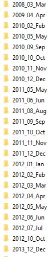
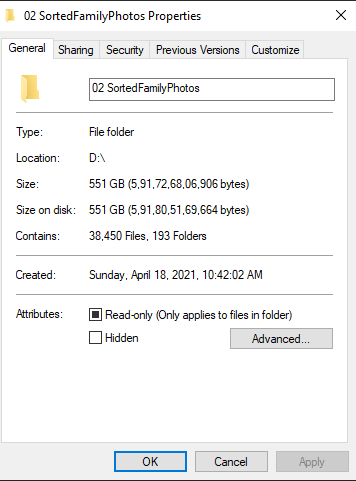

- [Photo Organiser](#photo-organiser)
- [How to execute](#how-to-execute)
- [Problem Statement](#problem-statement)
- [Solution](#solution)
  - [Questions & Feedback](#questions--feedback)
  - [Contributing](#contributing)
  - [Credits](#credits)

# Photo Organiser

This project will organize all the photos and videos that you have in Following Format YYYY_$MonthNumber_MONTH



I have actually been managed to sort 38,450 files using this



# How to execute

If you have java 8 and above setup on your machine following command will work.

```
cd /execute/
java -jar photo-organizer.jar -s "C:\tmp\test" -d "C:\tmp\photos"

-s is the source folder
-d is the destination folder where all the photos and videos will be moved .
Log will be generated in C:\tmp\PhotoOrganizer folder.
```

If Java 8 is not installed.

[How to setup Java](https://www.google.com/search?q=how+to+install+java+8+and+setup+environment+variables&rlz=1C1CHBD_en&oq=how+to+install+java+8+and+setup+environment+variables+&aqs=chrome..69i57j33i22i29i30l4.24527j0j7&sourceid=chrome&ie=UTF-8)

# Problem Statement

I had 310 GB of Photos and videos, in multiple folders and multiple locations .

Wanted to club them in following order 

> YYYY_$MONTHn_NUMBER_MONTH

# Solution

> ** All this movement happenned in 11 Mins **
> 
> Language : Java
> 
> OS : Windows
> 
> Libraries : 
> * Spring Boot 
> * com.drewnoakes -> metadata-extractor => this library helped me get the date from metadata of the files 
> [GitHub metadata-extractor](https://github.com/drewnoakes/metadata-extractor)
> 

## Questions & Feedback

The quickest way to have your questions answered is via [Stack Overflow](http://stackoverflow.com/questions/).
Check whether your question has already been asked, and if not, ask a new one tagged with `java`.

Bugs and feature requests should be provided via the project's [issue tracker](https://github.com/drewnoakes/metadata-extractor/issues).
Please attach sample images where possible as most issues cannot be investigated without an image.

## Contributing

If you want to get your hands dirty, making a pull request is a great way to enhance the application.
In general it's best to create an issue first that captures the problem you want to address.
You can discuss your proposed solution in that issue.
This gives others a chance to provide feedback before you spend your valuable time working on it.

## Credits

This app is developed by [Shirish Patil](https://github.com/wizardwand).

Thanks to [Drew Noakes](https://drewnoakes.com/code/exif/) for libarary .

Wherever possible, they have been credited in the source code and commit logs.
